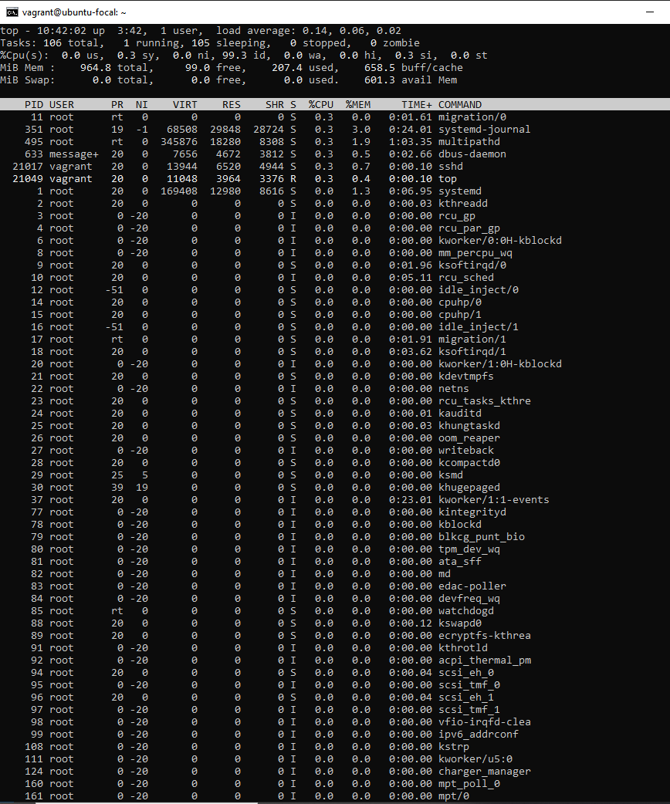
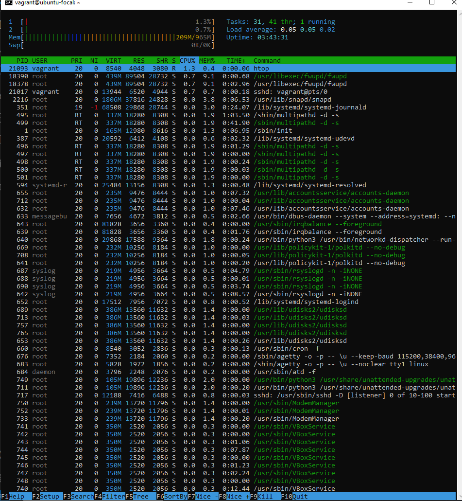
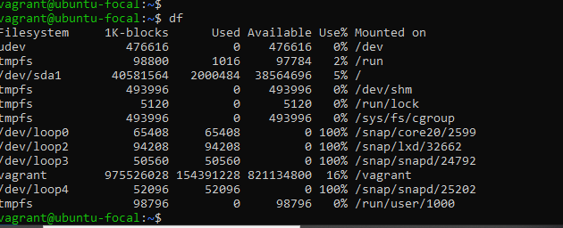
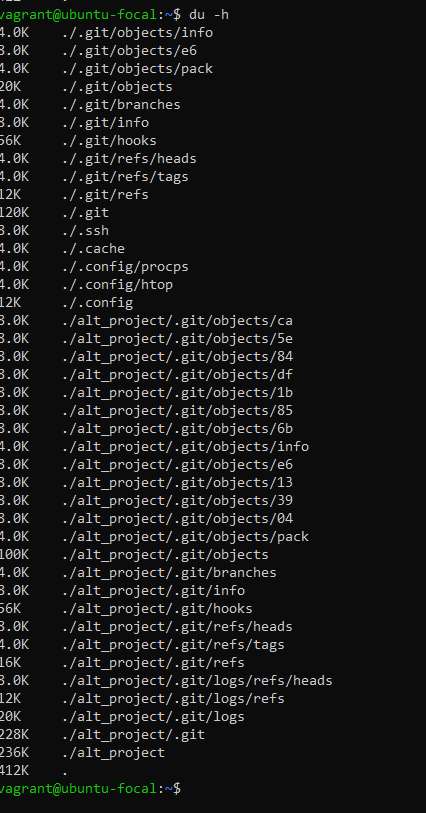
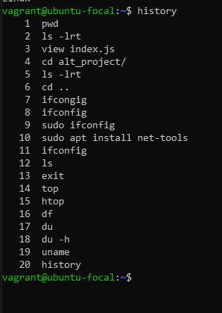
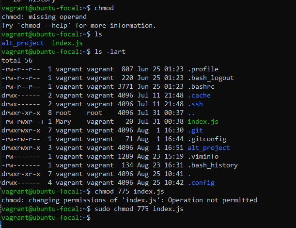
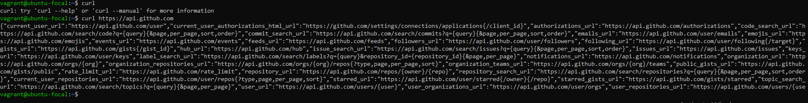

# Exercise 2: 10 Additional Linux Commands

This document explains 10 useful Linux commands (not covered in the previous module), with examples and screenshots.

---

## 1. `top`
- **Use:** Displays running processes and system resource usage in real-time.  
- **Example:**
  ```bash
  top




## 2. `htop`
- **Use:** An improved, interactive version of top.
- **Example:**
  ```bash
  htop




## 3. `df`
- **Use:** Shows disk space usage of file systems.
- **Example:**
  ```bash
  df -h




## 4. `du`
- **Use:** Displays disk usage of files and directories.
- **Example:**
  ```bash
  du -h



## 5. `uname`
- **Use:** Prints system information such as kernel name and version.
- **Example:**
  ```bash
  uname -a


## 6. `history`
- **Use:** Shows a list of previously executed commands.
- **Example:**
  ```bash
  history




## 7. `kill`
- **Use:** Terminates a process using its PID.
- **Example:**
  ```bash
  kill 4321


## 8. `chmod`
- **Use:** Changes file permissions (read, write, execute).
- **Example:**
  ```bash
  chmod +x script.sh



## 9. `wget`
- **Use:** Downloads files from the internet via HTTP/HTTPS/FTP.
- **Example:**
  ```bash
  wget https://example.com/file.zip


## 10. `curl`
- **Use:** Transfers data to/from a server (supports many protocols).
- **Example:**
  ```bash
  curl https://api.github.com




